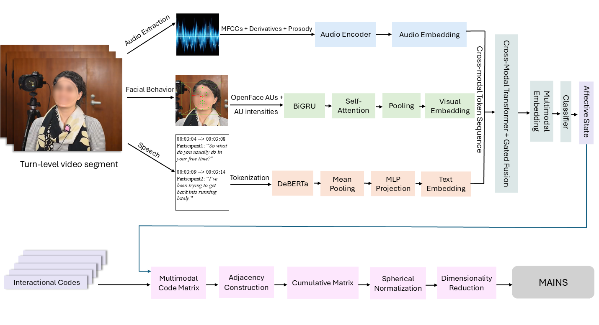

# MAINS

## Overview

MAINS (Multimodal Affective INteraction State Modeling) is a multimodal framework for modeling social interaction in natural conversations. It integrates affective state classification from audio, visual, and textual signals with network-based analysis to capture both the co-occurrence structure and temporal dynamics of affective and interactional states. Built on turn-level conversational data, the framework combines multimodal predictions with interactional discourse codes to provide interpretable representations of how social interaction is organized and unfolds over time.

  
  
<strong>Figure 1:</strong> Overview of the proposed MAINS framework for modeling social interaction. The framework first performs multimodal affective state classification from audio, visual, and textual signals extracted from turn-level conversational video segments. The predicted affective states are then integrated with interactional discourse codes to form a multimodal code matrix, followed by adjacency construction, cumulative matrix formation, spherical normalization, and dimensionality reduction to model the co-occurrence and temporal evolution of affective and interactional states.

## Process

1. **Turn-level Segmentation and Multimodal Feature Extraction**: 
   Each conversation is segmented into turn-level video units. From each segment, multimodal features are extracted from three sources:

Audio: MFCCs, derivatives, and prosodic features
Visual: facial Action Unit intensities extracted from OpenFace
Text: transcribed speech encoded through a transformer-based language model

2. **Multimodal Affective State Classification**: 
   The extracted audio, visual, and textual features are processed through modality-specific encoders and fused using a cross-modal transformer with gated fusion. The classifier predicts an affective state label for each conversational turn, represented as positive, neutral, or negative.

3. **Integration with Interactional Discourse Codes**: 
   The predicted affective states are combined with interactional discourse codes derived from the conversation transcripts. This step forms a multimodal code matrix that represents both affective and interactional information at the turn level.
   
4. **Adjacency Construction and Aggregation**: 
   The multimodal code matrix is used to construct adjacency matrices and cumulative representations of interaction patterns.
5. **Normalization and Dimensionality Reduction**: 
  The resulting representations are normalized and projected into a low-dimensional space for analysis and visualization.

6. **Modeling Social Interaction**: 
   The final MAINS framework captures both the co-occurrence structure and the temporal evolution of affective and interactional states.
